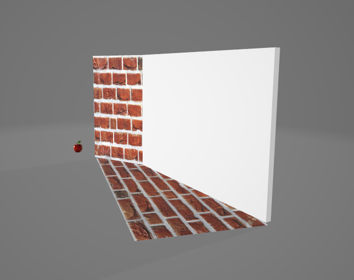

# samson_test_task_blender

Задание с реализацией воссоздания сцены из json-файла в 3d модель

>[!WARNING]
>подрузамеввается что все действия будут воспроизводиться из корня папки

* [Техническое Задание](./dock/myTZ.md)

## Клонирование

```cmd
git clone https://github.com/nais2008/samson_test_task_blender
cd ./samson_test_task_blender/
```

## Установка виртуального окружения

```cmd
python3 -m venv venv
source ./venv/Scripts/activate
```

## Установка зависимостей

### Для выпуска

```cmd
pip3 install -r ./requirements/prod.txt
```

### Для разработки

```cmd
pip3 install -r ./requirements/dev.txt
```

### Для тестирования

```cmd
pip3 install -r ./requirements/test.txt
```

## Заполняем переменные окружения

### Создаем файл

```cmd
touch .env
```

### Заполняем

```env
# Секретный ключ, должен быть индивидуален и засекерчен
DJANGO_SECRET_KEY=your_secret_key
# Включение DEBUG для приложения
DJANGO_DEBUG=false
DJANGO_ALLOWED_HOSTS=127.0.0.1,localhost
# blender или путь к blender.exe , так как не везде работает
DJANGO_BLENDER_PATH=blender
```

## Применение миграций

```cmd
cd ./samson/
python3 manage.py migrate
```

## Запуск проекта

```cmd
cd ./samson/
python3 manage.py runserver
```

## Запуск миграций в базе данных

```cmd
cd ./samson/
python3 manage.py migrate
```

## Пример

### Запроса

```json
[
  {
    "model_id": 1,
    "total_cost": 0,
    "type_budget": "comroft",
    "type_style": " scandiv",
    "square": 0,
    "floor": "/textures/wall.jpg",
    "partner": {
      "first_partner": {
        "id": 1
      },
      "second_partner": {
        "id": 2
      }
    },
    "light": [
      {
        "id": "1",
        "cordinate": {
          "x": 1,
          "y": 436,
          "z": 0,
          "rotate": { "x": 1, "y": 6, "z": 10 }
        }
      }
    ],
    "room": {
      "contour": [
        // Лучше использовать все таки путь
        { "x1": 5, "y1": 3, "x2": 3, "y2": 1, "texture": "textures/wall.jpg" },
        { "x1": -4, "y1": -1, "x2": 3, "y2": 1, "texture_id": "1" }
      ]
    },

    "objects": [
      {
        "link": "https://hoff.ru/catalog/spalnya/krovati/krovati_s_podemnym_mehanizmom/krovat_s_podyemnym_mekhanizmom_astra_id8685629/",
        "image": "https://hoff.ru/upload/iblock/1c1/t904h9xf7ku12vy1olh4wlvcxc0mowbk.jpg",
        "url": "/objects/apple.glb",
        "price": 20499,
        "type": "window",
        "title": "Divan_hoff",
        "rating": "5.00",

        "coordinates": {
          "x": 3,
          "y": 4,
          "z": 1,
          "rotate": 90
        },
        "alternative": [1, 2, 3, 4, 5, 6],
        "partner_name": "hoff",
        "partner_image": "/static/service/info/ref_partner/Hoff_image.png"
      }
    ]
  }
]
```

### Ответ

```json
{
    "status": "success",
    "model_id": 14,
    "scene_file_url": "/media/3d_models/scene_14.glb"
}
```

### Как выглядит



## Я старался, рад буду если прочитали)


